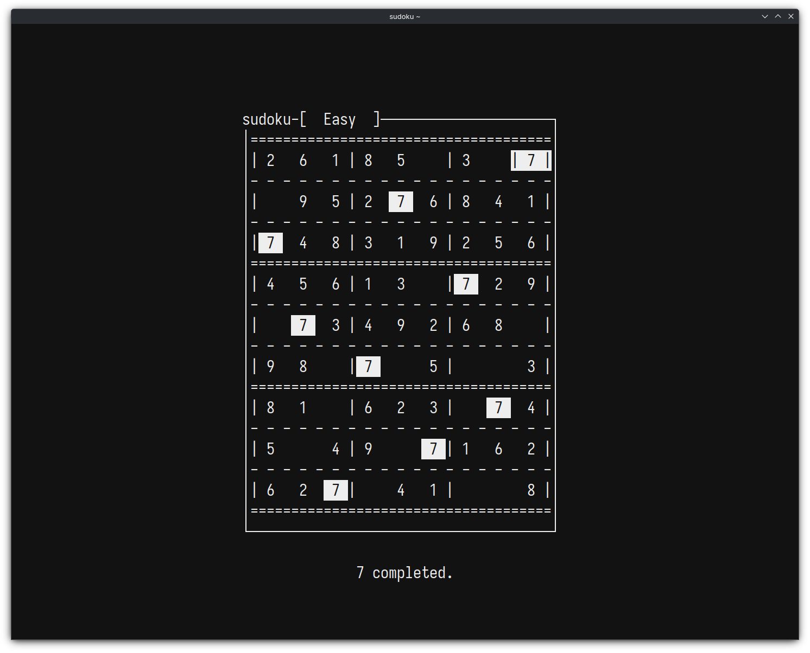

# sudoku

Sudoku in your terminal emulator.

## Images



More images [here](./images).

## Quick Start

```console
$ cc -o sudoku ./sudoku.c -lncurses
$ ./sudoku
```

Or, add the directory to your PATH, then use the build script to build and run:

```console
$ ./build.sh run
```

Depending on the day, you'll be in for a fun time! :v

## Dependency

- Ncurses

---
> Init day: 20250401
